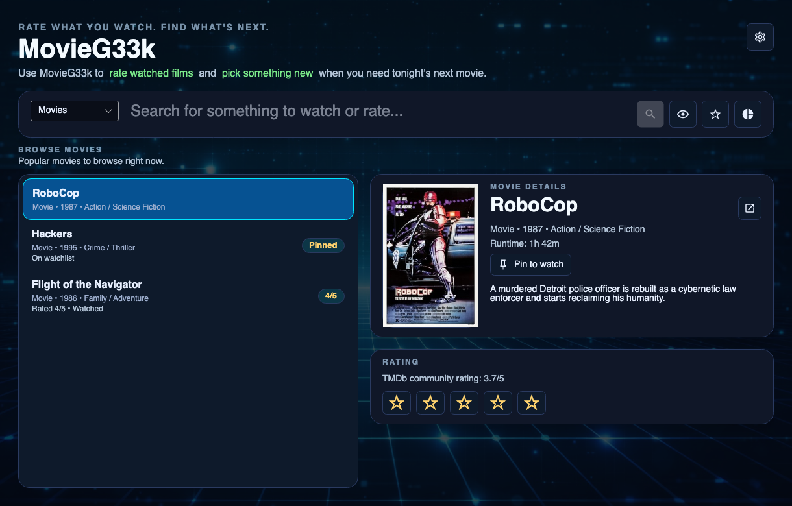
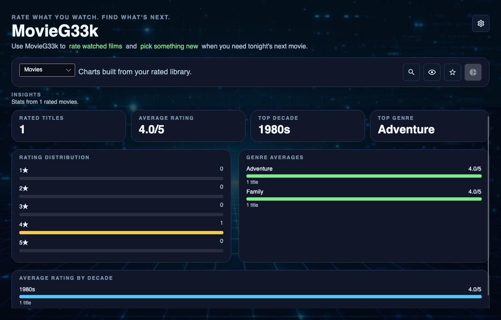
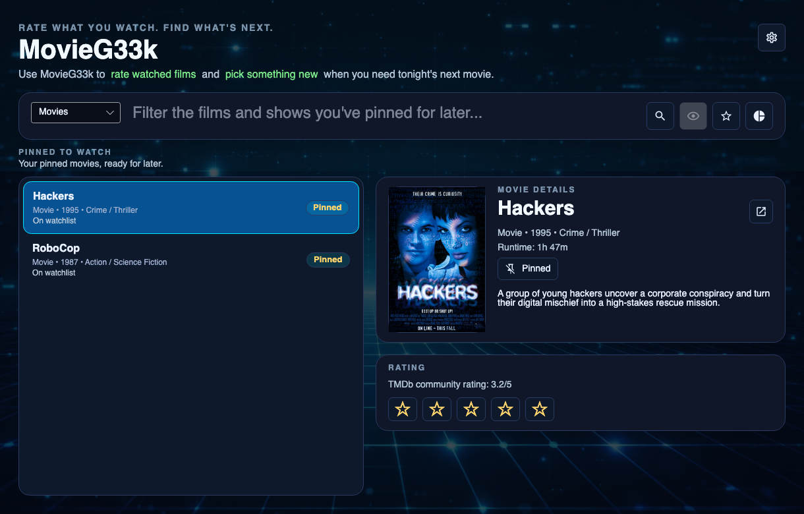
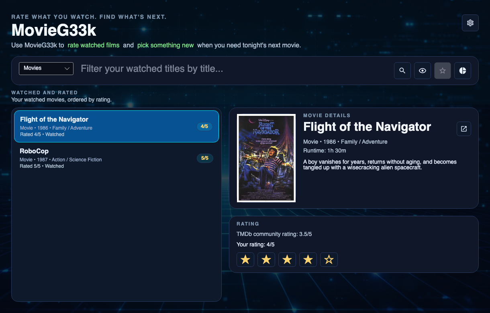

[](https://twitter.com/deanthecoder)

# MovieG33k
**MovieG33k** is a desktop app for keeping track of what you have watched, what you might want to watch next, and how you felt about it afterwards.

It is built around a simple idea:
- search for films and TV shows
- pin the ones that look interesting
- rate the ones you have watched
- keep your own history locally

MovieG33k stores your ratings, watched state, and imported items in a local SQLite database on your device. It uses TMDb for search and metadata, and IMDb CSV import is there as an optional bootstrap tool if you already have a ratings history elsewhere.

## Screenshots
### Browse movies
Search for something new, see the details, and decide whether to pin it for later.



### Insights
See how your ratings stack up with totals, averages, decade trends, and genre breakdowns.



### Pinned to watch
Keep a short list of titles you want to come back to.



### Watched and rated
Review the films you have already seen and keep your ratings in one place.



## What you can do today
- Browse and search movies and TV shows from TMDb.
- Give watched titles a simple 0-5 star rating.
- See your rating insights with charts for distribution, decades, and genres.
- Keep a pinned watchlist for titles you want to come back to.
- Import IMDb ratings from a CSV export.
- Keep your library, ratings, watched state, and metadata locally.

## First run
When MovieG33k starts for the first time, it will ask for a TMDb credential if one is not already configured.

TMDb is used for:
- live search
- discovery
- posters and metadata
- IMDb-to-TMDb matching during import

You can use either:
- a TMDb API Read Access Token
- the older TMDb API key

The credential is saved locally on your device.

## IMDb import
If you already rate things in IMDb, MovieG33k can import that history from a CSV export.

The import flow:
1. choose your IMDb CSV file
2. MovieG33k resolves IMDb IDs to TMDb titles
3. your ratings are added to your local watched history

IMDb import is optional. The app is meant to be useful on its own without repeated re-imports.

## Current status
MovieG33k is already useful as a first-pass personal movie tracker, but it is still early.

The current focus is:
- browsing and rating titles comfortably
- turning your ratings into useful personal insights
- keeping watched and pinned lists tidy
- building a good local source of truth for your movie history

Planned later work includes:
- better recommendation logic
- richer editing and review flows
- streaming provider availability by region

## Run from source
Prereqs: .NET 8 SDK.

```bash
dotnet build MovieG33k.sln
dotnet run --project MovieG33k/MovieG33k.csproj
```

Optional TMDb environment variables:

```bash
export TMDB_ACCESS_TOKEN=your_api_read_access_token
export TMDB_REGION=GB
export TMDB_LANGUAGE=en-GB
```

`TMDB_API_KEY` is also supported if you prefer the older key format.

## Project layout
- `MovieG33k/` contains the desktop app.
- `MovieG33k.Core/` contains the app models and orchestration.
- `MovieG33k.Data/` contains the SQLite persistence layer.
- `MovieG33k.Tmdb/` contains the TMDb client.
- `MovieG33k.Imdb/` contains the IMDb CSV import flow.
- `MovieG33k.Tests/` contains unit tests and the automated README screenshot test.
- `img/` contains the generated screenshots used in this README.

## Notes for contributors
- The README screenshots are generated by the test suite so the documentation stays close to the real UI.
- Shared UI styling, dialogs, and app helpers come from `DTC.Core`.

## License
Licensed under the MIT License. See [LICENSE](LICENSE) for details.
